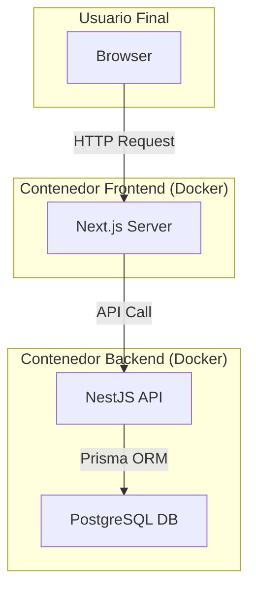

# Booking System - Full-Stack

[](https://nextjs.org/)
[](https://nestjs.com/)
[](https://www.typescriptlang.org/)
[](https://www.postgresql.org/)
[](https://www.docker.com/)
[](https://www.prisma.io/)

---

## 📖 Introducción

**Booking System** es una plataforma completa de reservas construida con un stack moderno, diseñada para ser robusta, escalable y fácil de usar. Permite a los usuarios descubrir y reservar servicios ofrecidos por diferentes negocios, mientras que los dueños de los negocios pueden gestionar sus perfiles, servicios y reservas de manera eficiente.

El proyecto está completamente **dockerizado**, permitiendo un despliegue y configuración local en cuestión de minutos.

---

## ✨ Features Principales

La plataforma está organizada en tres roles de usuario principales, cada uno con su propio conjunto de funcionalidades:

### 👤 **Cliente**
- **Autenticación Segura:** Registro e inicio de sesión con JWT, incluyendo rotación de `refresh tokens`.
- **Exploración de Negocios:** Busca y filtra negocios disponibles.
- **Visualización de Servicios:** Consulta los servicios, precios y duraciones de cada negocio.
- **Sistema de Reservas:** Agenda citas en los horarios disponibles.
- **Gestión de Reservas Propias:** Visualiza, actualiza y cancela tus propias reservas.

### 🏢 **Dueño de Negocio (Owner)**
- **Gestión de Perfil de Negocio:** Crea y actualiza la información de tu negocio.
- **Administración de Servicios:** Añade, edita o elimina los servicios que ofreces.
- **Dashboard de Reservas:** Visualiza todas las reservas de tu negocio.
- **Gestión de Estado de Reservas:** Confirma, completa o rechaza las reservas pendientes.

### 👑 **Administrador (Admin)**
- **Dashboard de Administración:** Panel centralizado para la gestión de la plataforma.
- **Gestión de Usuarios:** Visualiza todos los usuarios registrados.
- **Control de Roles:** Asigna roles (Cliente, Dueño, Admin) a cualquier usuario.
- **Eliminación de Usuarios:** Da de baja a usuarios de la plataforma.

---

## 🚀 Stack Tecnológico

La arquitectura está dividida en dos componentes principales: un backend de API REST y un frontend desacoplado.

### **Backend**
- **Framework:** [NestJS](https://nestjs.com/)
- **Lenguaje:** [TypeScript](https://www.typescriptlang.org/)
- **Base de Datos:** [PostgreSQL](https://www.postgresql.org/)
- **ORM:** [Prisma](https://www.prisma.io/)
- **Autenticación:** [JWT](https://jwt.io/) (Access & Refresh Tokens)
- **Validación:** `class-validator` y `class-transformer`
- **Contenerización:** [Docker](https://www.docker.com/)

### **Frontend**
- **Framework:** [Next.js](https://nextjs.org/) (App Router)
- **Lenguaje:** [TypeScript](https://www.typescriptlang.org/)
- **Estilos:** [Tailwind CSS](https://tailwindcss.com/)
- **Gestión de Estado de Servidor:** [TanStack Query (React Query)](https://tanstack.com/query/latest)
- **Formularios:** [React Hook Form](https://react-hook-form.com/) con [Zod](https://zod.dev/) para validación.
- **Componentes:** UI construida con componentes reutilizables.
- **Contenerización:** [Docker](https://www.docker.com/)

---

## 🏗️ Arquitectura

El sistema sigue una arquitectura de microservicios desacoplados, orquestados con Docker Compose para el entorno de desarrollo.



---

## 🏁 Cómo Empezar

Cada servicio (backend y frontend) es independiente y se despliega desde su propia carpeta.

### **Requisitos Previos**
- [Docker](https://www.docker.com/get-started) y [Docker Compose](https://docs.docker.com/compose/install/) instalados.

### **1. Backend**

El backend incluye el servidor de base de datos PostgreSQL.

```bash
# 1. Navega a la carpeta del backend
cd backend

# 2. Copia las variables de entorno de ejemplo
# (Ajusta los secrets si es necesario)
cp .env.example .env

# 3. Construye y levanta los contenedores (API + DB)
docker compose up -d --build

# 4. Aplica las migraciones de la base de datos
docker compose exec backend npx prisma migrate deploy

# 5. (Opcional) Llena la base de datos con datos de prueba
docker compose exec backend npx prisma db seed
```
> ✅ El backend estará corriendo en `http://localhost:3000`.

### **2. Frontend**

El frontend se conecta al backend.

```bash
# 1. Navega a la carpeta del frontend
cd frontend

# 2. Copia las variables de entorno de ejemplo
# (Asegúrate que NEXT_PUBLIC_API_URL apunte al backend)
cp .env.example .env

# 3. Construye y levanta el contenedor
docker compose up -d --build
```
> ✅ El frontend estará disponible en `http://localhost:3001`.

---

## 🧪 Pruebas de la Aplicación

Una vez que ambos servicios están corriendo, puedes probar la aplicación usando los usuarios de demostración que se crean automáticamente al ejecutar el seed.

### **Acceso a la Aplicación**

Abre tu navegador y dirígete a:
```
http://localhost:3001
```

### **Usuarios de Demostración**

El seed crea automáticamente tres usuarios con diferentes roles. Usa cualquiera de ellos para iniciar sesión:

| Rol | Email | Contraseña | Descripción |
|-----|-------|------------|-------------|
| 👑 **Admin** | `admin@demo.com` | `Demo1234!` | Acceso completo al panel de administración, gestión de usuarios y roles. |
| 🏪 **Propietario** | `owner@demo.com` | `Demo1234!` | Gestiona un negocio de ejemplo (Salón de Belleza), servicios y reservas del negocio. |
| 🙋 **Cliente** | `client@demo.com` | `Demo1234!` | Acceso a búsqueda de negocios, visualización de servicios y gestión de reservas personales. |

### **Datos de Prueba Precargados**

Cuando ejecutas `docker compose exec backend npx prisma db seed`, se crean automáticamente:

#### **Negocio de Ejemplo**
- **Nombre:** Salón de Belleza Demo
- **Dirección:** Av. Principal 123, Ciudad Demo
- **Descripción:** Centro de estética y bienestar. Servicios de alta calidad para tu cuidado personal.

#### **Servicios Disponibles**
| Servicio | Duración | Precio |
|----------|----------|--------|
| 💇 Corte de Cabello | 30 min | $15 |
| 🎨 Coloración | 90 min | $45 |
| 💅 Manicure | 45 min | $20 |
| 🦶 Pedicure | 60 min | $25 |
| 💆 Masaje Relajante | 60 min | $40 |

#### **Reservas de Ejemplo**
- **Hace 7 días:** Corte de Cabello (COMPLETED) — Cliente satisfecho con el resultado
- **Mañana:** Manicure (CONFIRMED) — Esmalte color rojo
- **En 7 días:** Masaje Relajante (PENDING) — Pendiente de confirmación

### **Flujos de Prueba Recomendados**

#### **1️⃣ Prueba como Cliente**
1. Inicia sesión con `client@demo.com`
2. Explora los negocios disponibles
3. Visualiza los servicios del Salón de Belleza Demo
4. Reserva un servicio para una fecha disponible
5. Ve a "Mis Reservas" y visualiza tu historial

#### **2️⃣ Prueba como Propietario**
1. Inicia sesión con `owner@demo.com`
2. Accede al dashboard de tu negocio
3. Visualiza las reservas pendientes
4. Confirma, completa o rechaza una reserva
5. Edita un servicio o agrega uno nuevo

#### **3️⃣ Prueba como Administrador**
1. Inicia sesión con `admin@demo.com`
2. Accede al panel de administración
3. Visualiza todos los usuarios registrados
4. Asigna nuevos roles a los usuarios
5. (Opcional) Elimina un usuario de prueba

---

---
Creado con ❤️ por Ricardo Suárez.
